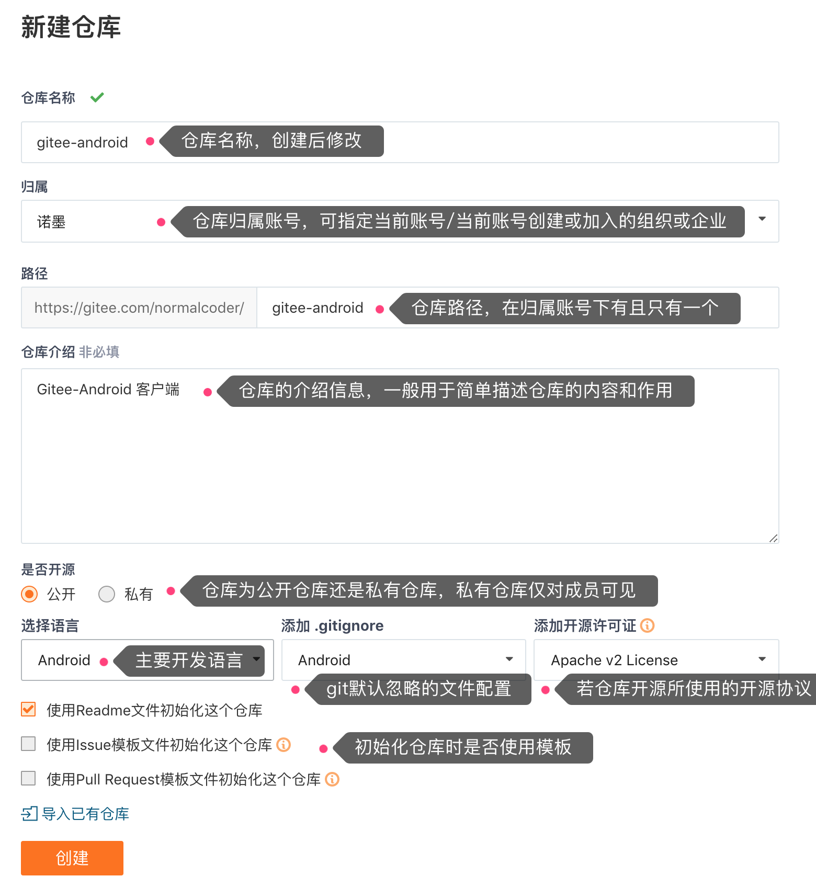
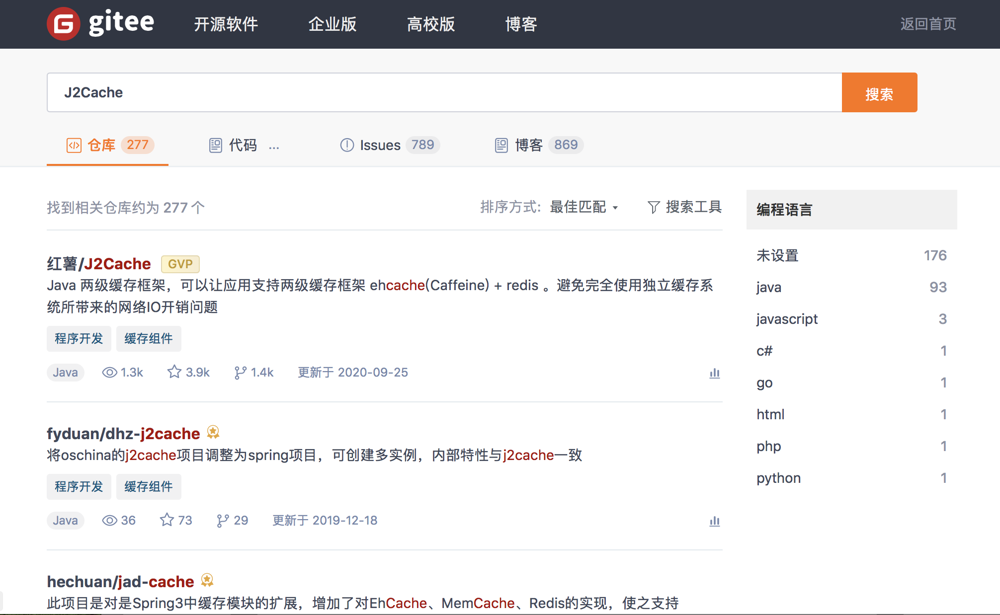
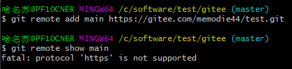

# 2. 仓库管理

## 2.1 新建仓库

- **路径**：仓库的git访问路径，由`用户个性地址+仓库路径名称`组成。创建仓库后用户将通过该路径访问仓库。
  
  > https://gitee.com/用户个性地址/HelloGitee.git

- **是否开源**：设置仓库是否为公开仓库，公开仓库对所有人可见，私有仓库仅限仓库成员可见。

- **添加开源许可证**：如果仓库为公开仓库，可以添加设置仓库的开源协议，作为对当前项目仓库和衍生项目仓库许可约束，开源许可证决定了该开源项目是否对商业友好。

- **Readme**：项目仓库自述文档，通常包含有软件的描述或使用的注意事项。

## 2.2 提交代码

Gitee 平台中，强烈建议您在【设置-多邮箱管理】中的“提交邮箱”与上面配置信息中的邮箱地址保持一致，这样平台就能及时地统计您在平台中提交代码的贡献了。

## 2.3 什么是 Release（发行版）

定义：代表项目中某个分支被编译好的二进制文件，供用户下载

[Release（发行版）CRUD操作介绍 - Gitee.com](https://gitee.com/help/articles/4328#article-header3)

## 2.4 筛选仓库

## 2.5 仓库在开启/暂停/关闭状态下所允许的操作

| 功能模块  | 功能点 / 具体操作            | 开启  | 暂停  | 关闭  |
| ----- | --------------------- | --- | --- |:---:|
| 界面展示  | 工作台、项目列表、下拉筛选列表       | 展示  | 隐藏  | 隐藏  |
| 代码    | 查看代码、Pull             | ✅   | ✅   | ✅   |
|       | 删除代码、Push             | ✅   | ❌   | ❌   |
| 文件    | 新建文件 / 文件夹 / 上传附件     | ✅   | ❌   | ❌   |
| 分支    | 新建、编辑、删除              | ✅   | ❌   | ❌   |
| 标签    | 新建、导入、编辑              | ✅   | ❌   | ❌   |
| 发行版   | 新建、编辑、删除              | ✅   | ❌   | ❌   |
| 里程碑   | 关联仓库                  | ✅   | ✅   | ❌   |
| PR    | 新建、合并、回退、关闭、编辑、指派     | ✅   | ❌   | ❌   |
|       | 审查、测试、评论              | ✅   | ✅   | ❌   |
| Wiki  | 新建、修改、删除              | ✅   | ❌   | ❌   |
| Issue | 新建、编辑、评论、指派、状态流转、关联仓库 | ✅   | ✅   | ❌   |
| 仓库    | 访问仓库、修改仓库状态           | ✅   | ✅   | ✅   |
|       | 评论、设置                 | ✅   | ✅   | ❌   |
|       | 删除                    | ✅   | ✅   | ✅   |

## 2.6 仓库转移

Gitee 现在提供3种转移：**仓库转移给个人**，**仓库转移到组织**，**仓库转移到企业**，用户可以在访问仓库的 **「管理」->「仓库设置」->「转移仓库」** 功能，对仓库进行转移操作。

## 2.7 仓库GC

[存储库GC - Gitee.com](https://gitee.com/help/articles/4173)

## 2.8 百度统计设置

通过 **「百度统计设置」** 在仓库嵌入百度统计后，开源项目作者可以获取详细的开源仓库访问明细，例如：访客来源、地区分布、搜索关键词、入口页面等诸多信息，  
帮助开源项目作者更有针对性的、更高效的运营项目

## 2.9 仓库成员管理

- CRUD 

- 权限修改

[仓库成员管理 - Gitee.com](https://gitee.com/help/categories/37)[仓库成员管理 - Gitee.com](https://gitee.com/help/categories/37)

# 3. 如何搜索开源项目

GVP(Gitee Most Valuable Projects)全称是 Gitee 最有价值开源项目计划，是 Gitee 综合评定出的优秀开源项目。

# 4. 如何导入 GitHub 等第三方 Git 仓库

[如何导入 GitHub 等第三方 Git 仓库 - Gitee.com](https://gitee.com/help/articles/4261#article-header0)

# 5. 开发协作

## 5.1 Fork + PullRequest 模式

参与 Gitee 中的仓库开发，最常用和推荐的首选方式是“Fork + Pull”模式。在“Fork + Pull”模式下，仓库参与者不必向仓库创建者申请提交权限，而是在自己的托管空间下建立仓库的派生（Fork）。至于在派生仓库中创建的提交，可以非常方便地利用 Gitee 的 Pull Request 工具向原始仓库的维护者发送 Pull Request。

1、什么是 Pull Request？

Pull Request 是两个仓库提交变更的一种方式，通常用于 fork 仓库与被 fork 仓库的差异提交，同时也是一种非常好的团队协作方式，下面，就来讲解如何在 Gitee 平台提交 Pull Request：

PS：Gitee 平台限制 Pull Request 源仓库与目标仓库需存在 fork 与被 fork 关系，故如果你要提交 Pull Request，必须先 fork 一个仓库，然后才能对该仓库提交 Pull Request，同时，以该仓库为父仓库的所有仓库，您也均可以提交 Pull Request。

# 6. 公钥管理

gitee中，公钥有：

- 账户公钥：具有推送拉取等权限

- 仓库公钥：只读权限

- 部署公钥：只读权限

为了便于用户在多个项目仓库下使用一套公钥，免于重复部署和管理的繁琐，Gitee 推出了「可**部署公钥**」功能，支持在一个仓库空间下使用当前账户名下/参与的另一个仓库空间的部署公钥，实现公钥共用。

## 6.1 Git配置多个SSH-Key

当有多个git账号时，比如：

a. 一个gitee，用于公司内部的工作开发；  
b. 一个github，用于自己进行一些开发活动；

解决办法：[Git配置多个SSH-Key - Gitee.com](https://gitee.com/help/articles/4229#article-header0)

# 7. 代码管理

## 7.1 克隆 Pull Request（none）

[克隆 Pull Request - Gitee.com](https://gitee.com/help/articles/4133#article-header0)

## 7.2Gitee SVN支持（none）

[Gitee SVN支持 - Gitee.com](https://gitee.com/help/articles/4131#article-header0)

[Gitee SVN 增加 SSH 支持 - Gitee.com](https://gitee.com/help/articles/4251)

## 7.3 PullRequest Cherry Pick 功能介绍（none）

[PullRequest Cherry Pick 功能介绍 - Gitee.com

](https://gitee.com/help/articles/4337#article-header1)

## 7.4 保护分支(none)

[保护分支 - 评审模式介绍 - Gitee.com](https://gitee.com/help/articles/4346)

[如何设置保护分支？ - Gitee.com](https://gitee.com/help/articles/4239)

## 7.5 Gitee 轻量级 PR(none)

[Gitee 轻量级 PR - Gitee.com](https://gitee.com/help/articles/4291#article-header0)

## 7.6 如何使用 CodeOwners 功能？(none)

在做日常迭代交付时提交的 PR，指定组内成员进行代码评审，当代码变更涉及到某文件或目录 A 时，大多数情况下会指派固定的人员 B 进行代码评审。我们就可以称为 B 是 组件 A 的 CodeOwner。简单来说，Codeowner 用来定义谁负责仓库中的特定文件或目录

详情查看[如何使用 CodeOwners 功能？ - Gitee.com](https://gitee.com/help/articles/4379)

## 7.7 Repo 工具使用介绍（none）

[Repo 工具使用介绍 - Gitee.com](https://gitee.com/help/articles/4316#article-header0)

# FAQ

1. 报错 fatal: protocol 'https' is not supported

在windows系统的Git bash软件中复制，粘体会导致https协议前，被添加一些特殊符号，如^?https://...

[具体请看stack overflow](https://stackoverflow.com/questions/53988638/git-fatal-protocol-https-is-not-supported)