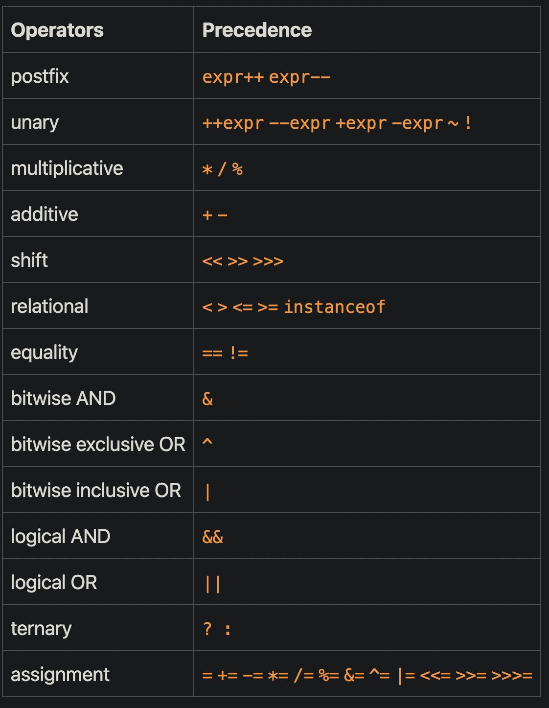
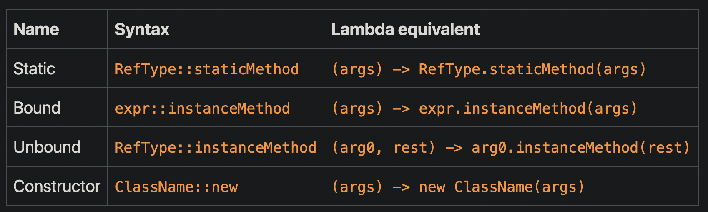

# 1. 面向对象概念

## 1.1 对象

对象由状态和行为构成。

识别现实世界对象的状态和行为是开始思考面向对象编程的好方法。

开发人员通过编写类来构造软件世界的对象，然后操纵对象进行交互来实现软件的功能。

## 1.2 接口

为了明确某类对象对外界提供的行为，Java提供了和类同级的接口。

开发人员通过让某个对象类实现一个接口，来明确该对象对外提供的行为。

# 2. 变量

## 2.1 变量种类

- 实例变量 = 非静态字段：对象将状态存储其中。
- 类变量 = 静态字段：对象间共享的状态。
- 局部变量：位于方法内部。
- 方法参数。

## 2.2 变量声明特点

基本类型的变量在声明时，操作系统便为其分配了内存空间，随后可进行初始化。

引用类型的变量在声明时，未创建内存空间，需要通过new来创建并随后进行初始化。

# 3. 语句

## 3.1 表达式语句和操作符优先级

表达式由变量、操作符和方法调用构成，操作符的优先级和结合性决定了表达式的值。

如下图：优先级由高到低，结合性除了赋值运算符之外的所有二元运算符都是从左到右计算的。




## 3.2 控制流语句

**Swtich语句**

switch 语句用名为选择器的变量作为参数，并使用该变量的值来选择将要执行的路径。

选择器变量允许的类型如下：

- byte、short、char 和 int原始数据类型和其包装类型
- 枚举类型
- String类型

注意：case后的语句无需使用封闭括号，其会按顺序执行。

**Break语句**

无标签的 break 语句可以用来终止循环语句和Switch语句，控制流转到该循环的下一个语句。

有标签的 break 终止可以用来终止标签语句，控制流转到该标签的下一个语句。

**Yield语句**

yield 语句也可以用来终止Switch语句，但是和break相比，其后必须跟一个表达式以返回值。

**Continue语句**

无标签的continue语句可以用来跳过循环语句的当前迭代，控制流转向下一次迭代。

有标签的continue语句用来跳过标签所指示的循环的当前迭代，控制流转向下一次迭代。

# 4. 数组

数组和类一样，是一种数据结构，其包含固定数量的单一类型值。

数组初始化的方式：

1. 使用new创建数组后，利用循环为数组元素赋值。
2. 在声明时利用`{ }`来创建并初始化数组。

# 5. 类

## 5.1 权限修饰符

权限修饰符用于限制其他结构对本结构的访问（结构指代类、接口），以下采用类进行说明：

> 该机制采用逐步控制，对类本身和类成员都进行修饰；首先要确定能够访问到类，才有机会访问类中的成员和构造函数。

类权限修饰符：

- public
- 包私有

成员和构造函数修饰符：

- public

- Private

- 包私有

- protected：指定成员只能被自己的包中的其他类访问，或者是被其它包中的子类访问。

## 5.2 字段初始化方式

除了局部变量，编译器会为类的字段赋初始值。初始化方式如下：

1. 声明时初始化。
1. 静态初始化块：为静态字段初始化；替代方式：使用一个私有静态方法。
1. 构造函数：为实例字段初始化。
1. 初始化块：为实例字段初始化，其代码会被复制到各个构造函数中。


## 5.3 this关键字

this关键字：在实例方法或构造函数中，this 是对当前对象的引用。


方法中形参若为数组，可以使用可变形参代替。

Java只支持值传递。

## 5.4 嵌套类

Java允许在一个类的内部再定义一个类，即嵌套类，分为静态和非静态。

**非静态嵌套类**（内部类）

内部类可以访问外部类的其他成员，即使它们被声明为私有。

内部类的实例生命周期依托其外部类的实例，因此它不能定义任何静态成员，但可以定义常量。

```Java
//内部类实例化的方式如下
OuterClass outerObject = new OuterClass();
OuterClass.InnerClass innerObject = outerObject.new InnerClass();
```

内部类又可以细分为局部类和匿名类。

局部类是在一个方法中定义的类，因此它还可以访问方法的参数和外部有效的final变量。

匿名类是没有名称的局部类，如果只需要使用一次局部类，就可以用匿名类来代替它。

------

**静态嵌套类**

静态嵌套类无权访问外部类的其他成员，因为它的行为等同于外部类，仅仅是为了方便。

------

## 5.5 嵌套类中重名变量的行为

```Java
public class ShadowTest {

    public int x = 0;

    class FirstLevel {

        public int x = 1;

        void methodInFirstLevel(int x) {
            System.out.println("x = " + x);
            System.out.println("this.x = " + this.x);
            System.out.println("ShadowTest.this.x = " + ShadowTest.this.x);
        }
    }

    public static void main(String... args) {
        ShadowTest st = new ShadowTest();
        ShadowTest.FirstLevel fl = st.new FirstLevel();
        fl.methodInFirstLevel(23);
    }
}
//结果
x = 23
this.x = 1
ShadowTest.this.x = 0

```

# 6. 继承

子类继承其父类的所有`public`和`protected`成员，无论子类在哪个包中。如果子类与其父类在同一个包中，它也继承父类的包私有成员。您可以按原样使用继承的成员、替换它们、隐藏它们或用新成员补充它们：

- 继承的字段可以直接使用，就像任何其他字段一样。
- 可以在子类中声明一个与超类中同名的字段，从而隐藏它。
- 可以在子类中声明不在超类中的新字段。
- 继承的方法可以直接使用。
- 可以在子类中编写一个与超类具有相同签名的新实例方法，从而**覆盖**它。
- 可以在子类中编写一个与超类具有相同签名的新静态方法，从而**隐藏**它。
- 可以在子类中声明不在超类中的新方法。
- 可以编写一个子类构造函数来调用超类的构造函数，可以隐式调用，也可以使用关键字 super。

## 6.1 继承带来的方法覆盖和隐藏

子类覆盖方法要求方法签名、返回类型和修饰符保持一致，返回类型也可以是超类中的子类型，修饰符比起父类权限可以更低

> 覆盖后子类中不存在父类的该方法，仅有子类版本。
>
> 通过使用final可以防止子类覆盖父类的方法，即子类必须使用父类的版本。

子类隐藏静态方法后，子类中同时存在父类和子类版本。

------

## 6.2 多重继承下的方法重名机制

类或者接口仅支持单继承，但可以实现多接口。

当超类和接口中的方法被继承发生冲突时，遵循两个规则：

1. 实例方法优于接口默认方法。

   ```Java
   public class Horse {
       public String identifyMyself() {
           return "I am a horse.";
       }
   }
   
   public interface Flyer {
       default public String identifyMyself() {
           return "I am able to fly.";
       }
   }
   
   public interface Mythical {
       default public String identifyMyself() {
           return "I am a mythical creature.";
       }
   }
   
   public class Pegasus extends Horse implements Flyer, Mythical {
       public static void main(String... args) {
           Pegasus myApp = new Pegasus();
           System.out.println(myApp.identifyMyself());
       }
   }
   //结果
   I am a horse.
   ```

2. 超类中被覆盖的方法将被忽略。

   ```Java
   public interface Animal {
       default public String identifyMyself() {
           return "I am an animal.";
       }
   }
   
   public interface EggLayer extends Animal {
       default public String identifyMyself() {
           return "I am able to lay eggs.";
       }
   }
   
   public interface FireBreather extends Animal { }
   
   public class Dragon implements EggLayer, FireBreather {
       public static void main (String... args) {
           Dragon myApp = new Dragon();
           System.out.println(myApp.identifyMyself());
       }
   }
   //结果
    I am able to lay eggs.
   ```

如果多个独立定义的默认方法冲突，或者默认方法与抽象方法冲突，则必须显式覆盖超类型方法。

即在子类中重写该方法，覆盖父类中的版本。

```Java
public class FlyingCar implements OperateCar, FlyCar {
    public int startEngine(EncryptedKey key) {
       
    }
}
```

------

## 6.3 继承所带来的多态

多态原指生物学中的一个原则：同一个物种可以有许多不同的行为。

由此一个类的子类可以定义它们自己独特的行为，并且共享一些与父类相同的功能。

在Java中，利用父类型的引用变量引用多个不同的子类对象，实现多态。

# 7. 接口

接口通过方法用来定义对象的行为，其将方法的使用对外公开，却隐藏实现。

接口可以定义常量、抽象方法、默认方法、静态方法和嵌套类。

- 接口中定义的所有常量值都是隐式公共的、静态的和最终的。

- 接口中的所有抽象、默认和静态方法都是隐式公共的；抽象方法隐式抽象的。

在接口继承中，父类中的默认方法可以被覆盖或者使其抽象化。

------

## 7.1 接口和抽象类的选择

如果这些陈述中的任何一个适用于您的情况，请考虑使用抽象类：

- 您希望在几个密切相关的类之间共享代码。
- 您希望扩展抽象类的类具有许多公共方法或字段。
- 您要声明非静态或非final字段。

如果这些陈述中的任何一个适用于您的情况，请考虑使用接口：

- 希望不相关的类会实现您的接口。
- 希望指定特定类型的实例的行为，但不关心是哪个类型实现。
- 想利用接口的多重实现。

# 8. 注解

定义：一种特殊的接口。

Java的注解本身对代码逻辑没有任何影响，但是开发人员可以通过反射API获取注解的相关信息，从而决定执行一些代码。

```Java
//注解声明
@interface ClassPreamble {
    //元素声明 
   String author();
   int currentRevision() default 1;
   // Note use of array
   String[] reviewers();
}
//注解的使用，位置包括类、方法、字段和参数
@ClassPreamble (
   author = "John Doe",
   currentRevision = 6,
   reviewers = {"Alice", "Bob", "Cindy"}
)
public class Generation3List extends Generation2List {}
```

## 8.1 元注解

注解的注解，无论是系统预先定义好的注解，还是自己定义的注解都需要使用元注解来配置注解的使用方式。

1. `@Retention`注解：指明被标记的注解的存储方式

- `SOURCE`类型的注解在编译期就被丢掉了；

- `CLASS`类型的注解仅保存在class文件中，它们不会被加载进JVM；

- `RUNTIME`类型的注解会被加载进JVM，并且在运行期可以被程序读取。

  > `SOURCE`类型的注解主要由编译器使用，因此我们一般只使用，不编写。`CLASS`类型的注解主要由底层工具库使用，涉及到class的加载，一般我们很少用到。只有`RUNTIME`类型的注解不但要使用，还经常需要编写。

2. @Documented：被标记的注解会出现在Javadoc中

3. @Target 注解：限制被标记注解可以使用的地方

- ElementType.ANNOTATION_TYPE 可以应用于注解之上。
- ElementType.CONSTRUCTOR 可以应用于构造函数。
- ElementType.FIELD 可应用于字段或属性。
- ElementType.LOCAL_VARIABLE 可以应用于局部变量。
- ElementType.METHOD 可以应用于方法。
- ElementType.PACKAGE 可以应用于包声明。
- ElementType.PARAMETER 可以应用于方法的参数。
- ElementType.TYPE 可以应用于类的任何地方。

4. @Inherited 注解：被标记注解可以出现在它的子类上，仅适用于类声明。

5. @Repeatable 注解：被标记的注解可以多次应用于同一个位置

# 9. 泛型

在定义类、接口和方法时，可以为其提供形式类型参数，使其变为泛型类、泛型接口和泛型方法。

> 类型参数提供了一种通过不同输入重用相同代码的方法。

类型参数的命名约定：单个大写字母；常用类型参数如下：

- E - Element 
- K - Key
- N - Number
- T - Type
- V - Value

```Java
//泛型类
public class Box<T> {
    public void set(T t) { /* ... */ }
    // ...
}
//泛型类在实例化时，需要提供实际类型参数值。
Box<Integer> intBox = new Box<Integer>();
//若使用普通语法将创建原始类型
Box rawBox = new Box();

```

------

**类型推断机制**

Java 编译器可以通过目标类型和实参自动推断类型参数的值，从而简化程序员使用泛型的步骤。

------

**有界类型参数**

定义泛型时，通过extends可以声明声明单界限的有界类型参数或者是多界限的有界类型参数，从而限制类型参数的值。

> 注意：声明多界限类型参数时，其第一个界限必须为类。


## 参数化类型作形参

当类型参数有值时，泛型将成为参数化类型，可以用作方法的形参。其中类型参数的值可以是普通类型和通配符。

1. 上界通配符：给定参数化类型的上限。
2. 无界通配符：未给定界限，因此可以使用任意的参数化类型。    
3. 下界通配符：给定参数化类型的下限。

通配符使用指南：

- 使用 extends 关键字，使用上限通配符定义“in”变量。
- 使用 super 关键字，使用下界通配符定义“out”变量。
- 如果可以使用 Object 类中定义的方法访问“in”变量，请使用无界通配符。
- 如果代码需要以“in”和“out”变量的形式访问变量，请不要使用通配符。

## 泛型继承


## 类型擦除

Java编译器采用类型擦除机制实现泛型。

- 如果类型参数是有界的，则将每个类型参数替换为其第一个边界，如果类型参数是无界的，则将其替换为 Object。

- 必要时插入类型转换以保持类型安全。

- 生成桥方法以保留扩展泛型类型中的多态性。

```Java
  //初始
  public class Node<T> {
  
      public T data;
  
      public Node(T data) { this.data = data; }
  
      public void setData(T data) {
          System.out.println("Node.setData");
          this.data = data;
      }
  }
  
  public class MyNode extends Node<Integer> {
      public MyNode(Integer data) { super(data); }
  
      public void setData(Integer data) {
          System.out.println("MyNode.setData");
          super.setData(data);
      }
  }
  //编译类型擦除后
  public class Node {
  
      public Object data;
  
      public Node(Object data) { this.data = data; }
  
      public void setData(Object data) {
          System.out.println("Node.setData");
          this.data = data;
      }
  }
  
  public class MyNode extends Node {
  
      public MyNode(Integer data) { super(data); }
  		//原先的覆盖方法经过擦除后，方法签名不一致
      public void setData(Integer data) {
          System.out.println("MyNode.setData");
          super.setData(data);
      }
  }
  //编译器为了保证一致性
  class MyNode extends Node {
  
      // Bridge method generated by the compiler
      //
      public void setData(Object data) {
          setData((Integer) data);
      }
  
      public void setData(Integer data) {
          System.out.println("MyNode.setData");
          super.setData(data);
      }
  
      // ...
  }

```

------

## 泛型使用限制

参考https://dev.java/learn/restriction-on-generics/#anchor_7


# 9. lambada表达式

用于简化函数式接口的实例化，也就是说，可以使用lambada表达式来创建并初始化函数式接口的实现类。

JDK 8 的新包：java.util.function，这个包有40多个函数式接口，它们围绕四个接口进行组织。

1. 第一个接口是 Supplier<T> 接口：其行为是不接受任何参数却返回一个对象。
2. 第二个接口是 Consumer<T> 接口：其行为是接受一个参数但不返回任何东西。
3. 第三个接口是 Predicate<T> 接口：其行为是接受一个参数，返回真假。
4. 第四个接口是 Function<T, R> 接口：其行为是接受一个类型为 T 的对象，并将该对象转换为任何类型为R的对象。

lambda 表达式的执行速度在程序中至关重要，而在使用过程中，可能会出现数字类型的自动装箱和拆箱，这会带来巨大的消耗。为此，JDK围绕上述四个接口提供经过优化的函数式接口（其接口名称和其中的抽象方法名称均有特定的规则）。

1. IntSupplier、BooleanSupplier、LongSupplier 和 DoubleSupplier。
2. IntConsumer、LongConsumer 和 DoubleConsumer。
3. IntPredicate、LongPredicate 和 DoublePredicate。
4. 有输入和输出参数，优化版本很多

函数式接口具体请看：https://dev.java/learn/using-lambdas-expressions-in-your-application/#supplier


## 方法引用



其中绑定方法引用中的expr是一个表达式，其值为对象，后面的实例方法也是在该对象调用；

而未绑定方法引用，RefType是类型名称，其后的实例方法的调用对象为arg0，需要传入。


## 链接和组合

 java.util.function 包的功能接口中存在许多默认方法和静态方法，目的是允许 lambda 表达式的链接和组合，从而编写更简洁和更易读的代码。

具体请看https://dev.java/learn/combining-lambda-expressions/ + https://dev.java/learn/writing-and-combining-comparators/

## Stream

|      | java.io                  | java.util.stream           |
| :--- | :----------------------- | -------------------------- |
| 存储 | 顺序读写的`byte`或`char` | 顺序输出的任意Java对象实例 |
| 用途 | 序列化至文件或网络       | 内存计算／业务逻辑         |

|      | java.util.List           | java.util.stream     |
| :--- | :----------------------- | -------------------- |
| 元素 | 已分配并存储在内存       | 可能未分配，实时计算 |
| 用途 | 操作一组已存在的Java对象 | 惰性计算             |

**创建`Stream`的方法**

- 通过指定元素、指定数组、指定`Collection`创建`Stream`；
- 通过`Supplier`创建`Stream`，可以是无限序列；
- 通过其他类的相关方法创建。

**`Stream`提供的常用操作**

转换操作：`map()`，`filter()`，`sorted()`，`distinct()`；

合并操作：`concat()`，`flatMap()`；

并行处理：`parallel()`；

聚合操作：`reduce()`，`collect()`，`count()`，`max()`，`min()`，`sum()`，`average()`；

其他操作：`allMatch()`, `anyMatch()`, `forEach()`。

# 10. 异常

异常是在程序执行期间发生的事件，它会中断程序指令的正常流程。

当方法中发生错误时，该方法会创建一个异常对象并将其交给运行时系统。

在方法抛出异常后，运行时系统会创建**调用堆栈**定位错误发生的地方，即查找异常处理代码。


------

**异常继承结构**


- 要检查异常 *checked exception*：程序编写正确，但是用户输入错误的数据导致，捕获是有意义的

- 不检查异常*unchecked exceptions*

  - 错误：硬件导致，可以选择捕获，而且有时候也是有意义的
  - 运行时异常：程序编写错误，可以捕获但没有意义，通常修改程序比较有用

  

------

**异常处理**：`try ... catch ... finally`语句

- 多个`catch`语句的匹配顺序非常重要，子类必须放在前面。

- 在catch语句中，如果其中抛出了新的异常时，应该将原始异常进行包裹从而抛出链式异常对象。

- `finally`语句若抛出异常会抑制catch的异常，因此通常需要保证finally语句不抛出异常。

  

------

**自定义异常体系**

- 推荐从`RuntimeException`派生“根异常”，再派生出业务异常。

# 11. 多线程

Java线程状态

- New：新创建的线程，尚未执行；
- Runnable：运行中的线程，正在执行`run()`方法的Java代码；
- Blocked：运行中的线程，因为某些操作被阻塞而挂起；
- Waiting：运行中的线程，因为某些操作在等待中；
- Timed Waiting：运行中的线程，因为执行`sleep()`方法正在计时等待；
- Terminated：线程已终止，因为`run()`方法执行完毕。

线程终止的原因

- 线程正常终止：`run()`方法执行到`return`语句返回；
- 线程意外终止：`run()`方法因为未捕获的异常导致线程终止；
- 对某个线程的`Thread`实例调用`stop()`方法强制终止（强烈不推荐使用）。

------

中断机制

Java规范：目标线程检测到`isInterrupted()`为`true`或者捕获了`InterruptedException`都应该立刻结束线程的执行即run方法的执行。

对目标线程调用`interrupt()`方法可以发出中断信号，目标线程通过检测`isInterrupted()检查中断信号的值（类型为布尔类型）来结束线程。

> 如果目标线程当时由于相关方法处于等待状态，则该线程只能通过补货中断异常的方式来结束线程。


## 同步机制

多个线程对共享字段或对象的读写会造成数据不一致，必须采取同步机制。

- synchronized关键字对同步代码块自动加锁解锁

- 同步锁，开发人员通过其实例方法手动加锁解锁

------

**线程协调**

1. synchronized、wait、notify协调机制
   - 在`synchronized`内部的锁对象上调用`wait()`使线程进入等待状态。
   - 在`synchronized`内部调用`notify()`或`notifyAll()`唤醒等待线程，wait方法返回然后重新尝试获取锁。

2. 同步锁、condition
   - 在同步锁对象获取condition对象
   - condition.await() = wait；condition.signalAll() = notifyall

------

可重入锁ReentrantLock：同一个线程可以多次获取锁对象。

悲观锁ReadWriteLock：也是可重入锁

- `ReadWriteLock`只允许一个线程写入；
- `ReadWriteLock`允许多个线程在没有写入时同时读取；

乐观锁StampedLock：不可重入

允许多个线程在一个线程写入的时候，也可以同时读取，相比于悲观锁，提高了读取的效率。

------

**原子操作**

- volatile变量：A线程的写入对B线程立马可见。

- Atomic原子类

## 线程池

Java用`ExecutorService`接口表示线程池，并提供工具类Executors来创建线程池。

- FixedThreadPool：线程数固定的线程池；

- CachedThreadPool：线程数根据任务动态调整的线程池；

- SingleThreadExecutor：仅单线程执行的线程池。

- ScheduledThreadPool：定期执行多个任务

  > Timer类只能定期执行一个任务

Callable和Future用于在线程执行完后获取执行结果。


# 参考

- [Java开发者官网](https://dev.java/)
- [廖雪峰官网](https://www.liaoxuefeng.com/wiki/1252599548343744)


  


